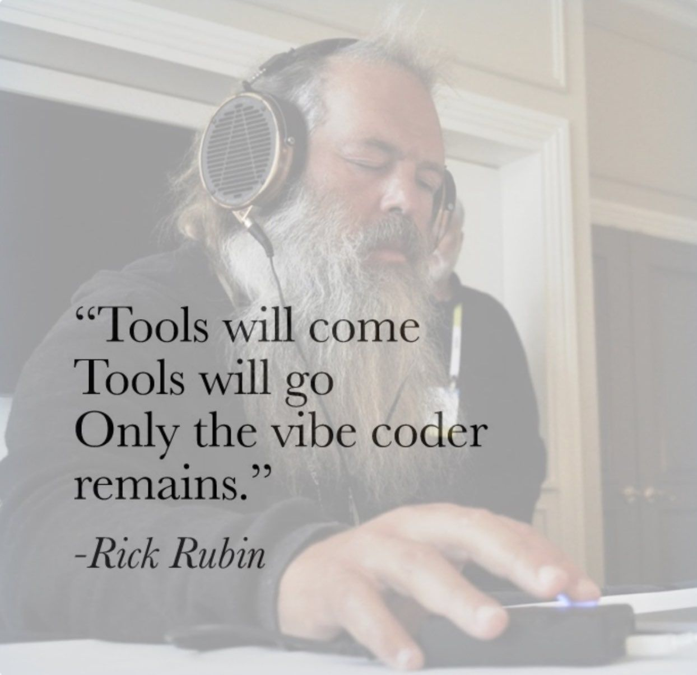

# Whisper Docker

A Docker container for real-time speech transcription using Faster Whisper.



## Overview

This project provides a containerized version of [Faster Whisper](https://github.com/SYSTRAN/faster-whisper) for speech-to-text transcription. It exposes a REST API for easy integration with Cursor/VSCode.

The container is built on `nvidia/cuda:12.8.0-cudnn-runtime-ubuntu24.04` and can be configured to use different Whisper models by modifying the Dockerfile and `main.py`.

## Requirements

- Docker
- NVIDIA GPU with CUDA support (Optional, but recommended)
- NVIDIA Container Toolkit installed (Optional)

## Quick Start

1. Pull and run the container:
```bash
docker run -d --gpus all -p 4444:4444 whisper-docker
```

2. The service will be available at `http://localhost:4444`

## Usage

When running successfully, you should see output similar to:
```
==========
== CUDA ==
==========

CUDA Version 12.8.0

INFO:     Started server process [1]
INFO:     Waiting for application startup.
INFO:     Application startup complete.
INFO:     Uvicorn running on http://0.0.0.0:4444 (Press CTRL+C to quit)
```

The service exposes a REST API endpoint for transcription. You can then use it with Cursor/VSCode.